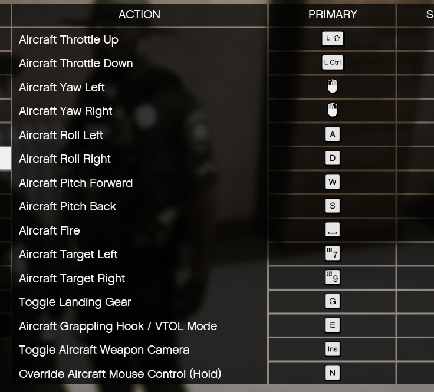

# EMT & Paramedic Duties

- Responding to 911 calls
- Providing first aid, CPR and resuscitation
- Assessing a patient’s health and current condition
- Deciding on immediate care based on the assessment
- Providing life support
- Transporting patients in an ambulance to an emergency room or hospital
- Transporting patients from the ambulance into the hospital
- Communicating with nurses, doctors, and other health care professionals
- Documenting care given to patients
- Cleaning, replacing, and inventorying equipment

Where EMTs and paramedic practitioners differ is in the types of care that may be administered to a patient. In general, an EMT is not allowed to perform any procedure that punctures the patient’s skin. An exception to this is the use of life-saving injections, such as an epinephrine auto-injector used to treat anaphylaxis from an allergic reaction or the medication used to reverse an overdose caused by opioid drugs.

Other procedures that paramedics may perform, and that EMTs do not, include administering medications, inserting intravenous lines and administering fluids, using and interpreting electrocardiograms, using other advanced health and life support monitors, providing advanced airway management, and caring for and administering life support for patients with significant health problems, like trauma or cardiac arrest.

## Generalized Rules

- Follow traffic laws to a reasonable extent
- Do not use code (lights and sirens) unless responding to an emergency call
- Wear proper EMS related attire while on duty.
- Do not use personal vehicles (Unless Certified Take Home) while on duty.
- Do not use EMS provided ambulances while off duty.
- Do not commit any crimes, or aid in any crimes while on duty
- Alert police to any serious crimes you see being actively committed while on duty.
- Do not notify police of any recent drug use by patients, that is patient privacy protected health care information and is not to be shared with any outside parties.
- Avoid carrying firearms while on duty, tasers and flashlights are encouraged.
- Refill your med-kits and bandages whenever possible to try and stay full.
- Try and keep yourself busy and maintain RP during downtime.
- You have a Duty to Act, an obligation to provide care to patients when it is within your capabilities.
- Be professional but have fun
- Do not use helicopters while on duty, the current risk they prove does out outweigh the benefits.
- You can use the ambulance to transport patients to destinations, do not use the ambulance as a taxi. Civilian “ride alongs” are permitted if approved by a Line Officer+.
- All junior EMT-B’s must be accompanied by a EMT-I or TL unless given permission to ride solo prior to shift.
- Chain of command is EMT-B > EMT-I > Team Leader > Assistant Chief > Chief.

## Radio Operations
Radio Operations consist of everything transmitted over the radio from when calling in service as your call sign, until you call out of service as your call sign. ( 10 Codes Are A WIP ) 
- When going into service at the start of your shift, you are to state what station you are at, and your call sign. 

## Driving Procedures

### Clearing Intersections
When an on duty worker is approaching a controlled intersection, they shall slow down to a rolling stop, and only proceed when it is confirmed that there isn't any traffic or all traffic has come to a stop. This

### Speed Limit
All on duty vehicles, with the exception to the Fly Car's, shall not exceed 90 MPH on any paved roadway. The Fly Car's shall not exceed 140MPH on any paved roadway, unless absolute emergency.

On any dirt roads, speeds shall not exceed 40 MPH with the exception of Brush and Fly Car's. The Brush and Fly Car shall not exceed 60 MPH on any dirt roads.

:::warning
**Arrive Alive, Don't become another patient due to your crappy driving**
:::

While maintaining the Ambulance with a loaded patient, the ambulance shall not exceed 85 MPH under any circumstance. When you're transporting HIGH PRIORITY, you still shall not exceed 85 MPH. When going LOW PRIORITY, please be careful and obey the speed limits and traffic laws. Take corners slowly and keep in mind you have at least a patient, if not a co-worker in a box that you don't want to get banged up by the time you get to the hospital. You are responsible for your driving, You can be ticketed if you are breaking the legal laws.

### CDL

If you are driving a fire apparatus of 30,000 pounds or greater then you must have your Commercial Driver's License. That means in order to drive the Engine, Rescue And Ladder truck you must have a CDL.

### Off Roading

All large vehicles (Ambulance, Engine, Rescue, Ladder Trucks) are only to be driven on paved and dirt roads, North Calafia Way, and Raton Canyon, and Cassidy Trail are considered dirt roads. Do not take these large vehicles off road as they will sink. The Brush truck and FlyCar can be driven on dirt trails and on hard packed sand/gravel (do not drive on loose sand or off trail). The Rover is to be used for all terrains. 

### Helicopter Controls
